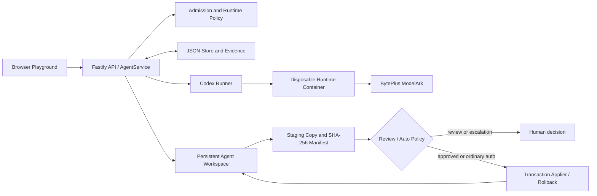

# Volc Agent Launchpad

Volc Agent Launchpad is a TikTok TechJam 2026 Track 1 proof of concept for
running coding Agents with a governable control plane. It combines a React
Playground, a Fastify API, persistent Agent sessions, Codex CLI, and BytePlus
ModelArk—while keeping model filesystem changes as backend-verified proposals
until policy permits them to reach the persistent Agent workspace.

> [!WARNING]
> This is a single-user POC, not a production multi-tenant service. Do not use
> production credentials or sensitive data. The API has optional shared-token
> protection, not individual identity or role-based approval.


## What this project demonstrates

- **Persistent Agents:** create, edit, start, stop, and continue multi-turn
  Codex sessions from the browser.
- **Pre-Run Resource Governance:** optional maximum prompt length, admitted
  Run count, and cumulative model-token budget. The trusted backend decides
  before a Runtime starts.
- **Runtime Governance:** per-Agent duration and output limits, container CPU,
  memory, and PID caps, Stop versus Kill, and repeated-termination quarantine.
- **Transactional Workspace Protection:** Codex works in a staging copy, not
  the persistent Agent workspace. The backend computes SHA-256 filesystem
  evidence, then applies approved changes transactionally with backups and
  rollback.
- **Review and Auto modes:** Review asks for a decision on every eligible diff.
  Auto applies only ordinary code/document changes according to deterministic
  backend rules; risky changes still escalate for review.
- **Restart-aware evidence:** Runs, messages, governance events, change sets,
  and nonterminal transaction recovery state persist locally.

## Quick start: local POC

### Requirements

- Node.js 22.9 or later
- npm 10 or later
- One running container engine: Docker, Colima, or rootless Podman
- A BytePlus ModelArk API key and a Responses-compatible endpoint/model ID

Codex CLI is included in the disposable Runtime image; it is not required on
the host for this POC path.

### 1. Clone and enter the repository

```bash
git clone https://github.com/Akshay-2007-1/TechTokers.git
cd TechTokers
```

### 2. Export ModelArk settings in the current shell

Use your own values. Do not put real credentials in Git, screenshots, issue
comments, or prompts.

```bash
export ARK_API_KEY='your-byteplus-ark-api-key'
export ARK_MODEL='your-responses-compatible-endpoint-id'
export ARK_BASE_URL='https://ark.ap-southeast.bytepluses.com/api/v3'
```

`ARK_BASE_URL` is important when your endpoint is outside the default Beijing
region. The exported variables exist only in this shell session; open a new
terminal and export them again, or load them from a local ignored `.env` file.

### 3. Start the POC

```bash
npm run poc
```

The command:

1. Checks for Docker, Colima, or Podman.
2. Installs dependencies with `npm ci` when `node_modules` is absent.
3. Builds the disposable Codex Runtime image.
4. Starts the React/Fastify application at <http://localhost:3000>.
5. Runs each Agent turn in a disposable container with staging mounted at
   `/workspace`.

Open <http://localhost:3000>. Press `Ctrl+C` in the startup terminal to stop
the control plane. Agent metadata, sessions, and persistent workspaces remain;
the local POC script removes this instance's leftover Runtime containers.

### Optional local `.env` loading

The repository ignores `.env`. If you prefer local file-based configuration,
create it from the example and source it into your current shell:

```bash
cp .env.example .env
# Edit only your local .env with your ModelArk values.
set -a
. ./.env
set +a
npm run poc
```

Do not commit `.env`.

### Select an engine or local state location

```bash
# Force rootless Podman instead of Docker/Colima.
export CONTAINER_ENGINE=podman

# Keep POC metadata, workspaces, and Codex-home state somewhere explicit.
export LOCAL_POC_DATA_ROOT="$PWD/.local"

npm run poc
```

Default persistent state is `~/.volc-agent-launchpad/` on macOS and `.local/`
in the repository on Linux. See [Local POC details](docs/LOCAL_POC.md),
including rootless Podman setup and container-mount troubleshooting.

## Use the Playground

1. Open <http://localhost:3000> and choose **Create Agent**.
2. Give it a name, short description, and system instructions describing the
   coding task it should perform.
3. Select a workspace mode:
   - **Review** — every eligible filesystem diff waits for your decision.
   - **Auto** — ordinary code/document diffs can apply automatically; risky
     changes still wait for review.
4. Optionally set resource and Runtime limits in Agent configuration.
5. Send a message in the Playground. The Run status, messages, governance
   evidence, and any proposal appear in the Agent view.

The mode selector near the input controls the selected Agent's workspace policy
and is disabled while that Agent has an active Run.

### Stop versus Kill

- **Stop** requests ordinary cancellation and leaves the Agent stopped.
- **Kill** is the containment control. It force-terminates an active Run,
  records a termination event, and leaves the Agent stopped until you start it
  again.

Repeated duration or output-limit terminations can auto-quarantine an Agent.
Starting it again clears the stopped/error state; prior governance evidence is
retained.

## Demonstrate the architecture in action

These are manual, reproducible demo flows. They are designed to exercise the
actual backend boundaries rather than rely on model claims.

### A. Review mode: stage, inspect, approve

1. Create an Agent in **Review** mode.
2. Prompt it:

   ```text
   Create a file named hello.md that explains this Agent's purpose.
   ```

3. Wait for Run status **Awaiting approval**. The persistent workspace is still
   unchanged; the shown manifest is derived from a staging copy.
4. Inspect the create/modify/delete summary and choose **Approve**.
5. The backend validates the current persistent base and staged SHA-256 hashes,
   creates a transaction journal/backups, applies the change, and completes the
   Run. The staged directory is discarded.

### B. Review mode: deny and observe reconciliation feedback

1. Create another Review-mode proposal.
2. Choose **Deny**.
3. Send the Agent another message.

The backend includes a short platform notice in the next Agent turn explaining
that the previous proposal was denied and was not applied. This prevents the
next turn from assuming that its earlier filesystem claim succeeded.

### C. Auto mode: ordinary change versus escalation

1. Switch the Agent to **Auto** mode.
2. Prompt it to create or edit an ordinary `.ts`, `.tsx`, `.js`, `.py`, `.md`,
   `.txt`, `.css`, or similar source/document file.
3. The backend hashes and classifies the diff. Ordinary eligible changes are
   transactionally applied without a popup.
4. Next, ask it to delete a file it previously created, or modify a package,
   lockfile, Docker, Compose, or other non-allowlisted path.

Deletion and risky paths are escalated to the same review flow; Auto mode is
not a model-selected bypass.

### D. Protected files and staging isolation

1. Ask an Agent to create or edit `.env`.
2. The persistent `.env` is excluded before staging is copied, so it is not
   mounted into the Runtime workspace.
3. Any staging `.env` output is excluded from the manifest and discarded with
   staging; it must not be treated as a persistent change.

Other forbidden manifest paths—including `.git`, credential/secret-named
files, `.pem`, and `.key` files—are backend-denied when they appear in the
manifest. Symlinks and special files are rejected during manifest processing.

### E. Resource Governance: pre-Run denial

Create an Agent with a deliberately small **Maximum prompt length**, **Maximum
Runs**, or **Total-token budget**. Then submit a request that exceeds the
chosen policy.

Expected behavior:

- The backend denies the request before `runner.run()`.
- Codex is not invoked and no model tokens are intentionally consumed.
- Budget evidence records the decision without retaining your prompt text.

For Run-count policy, an admitted Run consumes a slot even if it later fails or
is cancelled. A denied Run consumes no slot.

### F. Runtime containment: Kill and quarantine

1. Start a Run that will remain active long enough to observe its running state.
2. Use **Kill** while it is running.
3. The Run becomes **Terminated** with an operator-kill reason, and the Agent
   becomes stopped.
4. Start the Agent again to use it.

To demonstrate automatic quarantine, configure a low duration or output limit
and cause duration/output terminations repeatedly. Operator-initiated Kills do
not count toward the quarantine threshold.

### G. Restart persistence

1. Leave a Review-mode change set pending.
2. Stop the server with `Ctrl+C` and re-run the same shell exports plus
   `npm run poc`.
3. Reload the browser. The pending proposal remains available because change
   sets are stored in the JSON database.

If a proposal expires, or is denied, its staging directory is discarded and a
later Agent turn receives a reconciliation notice. Expiry is reconciled on
service startup, proposal lookup, or the next message request.

## Architecture at a glance



Key guarantees and limits:

- The backend treats staging hashes and manifests—not Agent text—as the source
  of truth for filesystem proposals.
- The persistent Agent workspace is not mounted at `/workspace` for a
  container Run; staging is mounted instead.
- Approval validates the original base and staged hashes before any persistent
  mutation. Multi-file apply journals backups, defers deletions, and rolls back
  earlier operations after a later failure.
- JSON persistence and admission serialization are **single-process POC**
  guarantees, not distributed locking.
- Container CPU/memory/PID caps apply only with `RUNTIME_PROVIDER=container`.
  The host `local-process` runner is weaker and is not the recommended local
  POC path.
- Runtime event parsing retains final output, thread ID, usage, and errors; it
  does not expose a full tool/command lifecycle.

For the complete implementation audit, including state machines, boundaries,
test coverage, and residual limitations, see
[Architecture Audit](docs/ARCHITECTURE_AUDIT.md).

## Configuration reference

| Variable | Typical local POC value | Purpose |
|---|---|---|
| `ARK_API_KEY` | Required | ModelArk API key; keep local only. |
| `ARK_MODEL` | Required | Responses-compatible ModelArk endpoint/model ID. |
| `ARK_BASE_URL` | Regional `/api/v3` URL | ModelArk endpoint base URL. |
| `CONTAINER_ENGINE` | `docker` or `podman` | Select local container engine. |
| `LOCAL_POC_DATA_ROOT` | Optional directory | Persistent local data/workspaces/session root. |
| `WORKSPACE_APPROVAL_TTL_MS` | `86400000` | Pending-proposal TTL in milliseconds. |
| `CONTAINER_CPU_LIMIT` | `2` | Default disposable-container CPU cap. |
| `CONTAINER_MEMORY_LIMIT` | `2g` | Default disposable-container memory cap. |
| `CONTAINER_PIDS_LIMIT` | `256` | Default disposable-container PID cap. |
| `RUNTIME_QUARANTINE_THRESHOLD` | `3` | Duration/output termination count before quarantine. |
| `RUNTIME_QUARANTINE_WINDOW_MS` | `600000` | Rolling quarantine window in milliseconds. |
| `APP_AUTH_TOKEN` | Optional on local loopback | Shared demo token; use 24+ characters for remote exposure. |

See [.env.example](.env.example) for the full configuration surface. For Docker
Compose/ECS deployment, see [Deployment](docs/DEPLOYMENT.md). Compose has a
different runtime profile and should not be confused with the disposable local
POC container flow.

## Development and validation

For browser/API development:

```bash
npm install
npm run dev
```

- Web development server: <http://localhost:5173>
- API: <http://localhost:3000>

Run static and unit validation:

```bash
npm run typecheck
npm test
npm run build
```

`npm run check` runs all three. At the time of the architecture audit,
59/60 server tests passed; the output-flood termination test in
`apps/server/src/codex-runner.test.ts` exceeded Vitest's five-second timeout.
Do not describe the full suite as green until that test passes in your
environment.

## Further documentation

- [Complete architecture audit](docs/ARCHITECTURE_AUDIT.md)
- [Architecture and extension boundaries](docs/ARCHITECTURE.md)
- [Resource Governance details](docs/RESOURCE_GOVERNANCE.md)
- [Local POC and rootless Podman](docs/LOCAL_POC.md)
- [Deployment](docs/DEPLOYMENT.md)
- [Hackathon extension guide](docs/HACKATHON_EXTENSION_GUIDE.md)
- [Security policy](SECURITY.md)
- [Contributing](CONTRIBUTING.md)

## License

[MIT](LICENSE)
