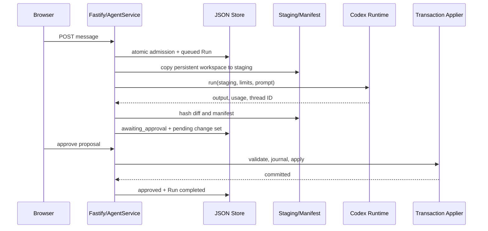
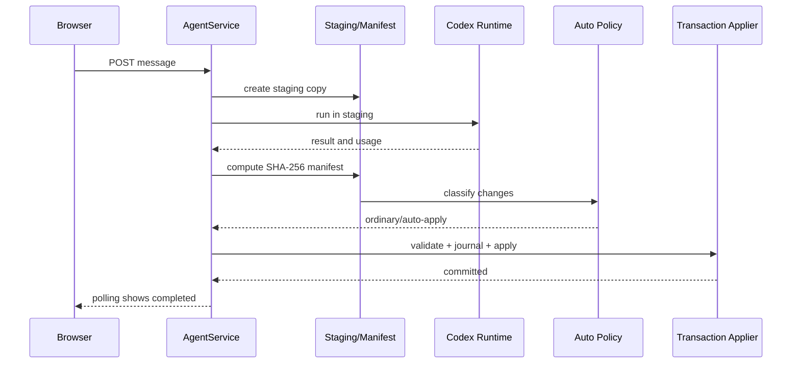

# Read-only architecture audit

## 1. Repository provenance

| Item | Verified state |
|---|---|
| Audited ref | `main` at `a633761e345ae92d354319db68c8e38e01e7a0dd` |
| Commit subject | `Add transactional workspace approval modes (#7)` |
| Tracking | `main...origin/main` |
| Worktree | **Not clean:** one untracked local file, `volc-agent-launchpad@1.0.0`. No tracked modifications observed. |
| Relevant local branches | `main`, `feature/transactional-workspace-approval` at `0313085`, `feature/approval-ui-polish` at `a3bf108` |
| Relevant remote-tracking branches | `origin/main`, `origin/feature/transactional-workspace-approval`, `origin/feature/approval-ui-polish` |
| Stashes | `git stash list` returned no stash names. |
| Scope of this audit | The checked-out `main`, not the unmerged UI-polish branch. |

The current commit contains the three claimed feature areas in executable code:

| Capability | History evidence |
|---|---|
| Resource Governance | `91052b7 Add Agent Resource Governance controls (#2)` |
| Initial runtime stop/limits work | `da249c7 Add per-Agent runtime kill switch (terminate a Run in progress) (#4)` |
| Expanded runtime governance/quarantine | `8e19013 Add operator kill switch, auto-quarantine, and per-Run compute caps (#5)` |
| Transactional workspace approval | Current merge commit `a633761 Add transactional workspace approval modes (#7)`; earlier feature-branch commits include staging, applier tests, and recovery work. |

The implementation broadly matches the claimed capabilities, but important limits and discrepancies are documented below.

Validation run:

```bash
npm test --workspace @launchpad/server
```

This did not start the application, invoke ModelArk, Docker, or external network services. Result: **59/60 tests passed; one test failed by timeout**:

- `apps/server/src/codex-runner.test.ts`
- `terminates a Run that floods more output than allowed`

The test exceeded Vitest's five-second timeout. No tracked files changed. An ignored `apps/server/dist/` directory exists, but its timestamp predates this audit; this test run did not create observable build output.

---

## 2. Component inventory

| Layer | Component | Starter or team-added | Process/location | Primary responsibility | Inputs | Outputs | Persistent state touched | Trust/enforcement role | Exact code evidence |
|---|---|---|---|---|---|---|---|---|---|
| Experience Layer | React Playground | Baseline present; team extended | Browser | Agent creation, message submission, status/policy/approval controls | Form state, API responses | HTTP requests, rendered messages/runs | None directly | UI transports requests; does not enforce policy | `apps/web/src/App.tsx`: `App`, `handleSend`, `decideChanges`, `setWorkspaceMode`, `pollRun` |
| Experience Layer | API client/types | Baseline present; team extended | Browser | Typed API transport and optional bearer token attachment | Browser state | JSON API calls | In-memory auth token only | Transport boundary, not authorization | `apps/web/src/api.ts`: `request`, `setAuthToken`; `apps/web/src/types.ts` |
| Fastify/API Boundary | Fastify application | Baseline present; team extended | Node/Fastify | Request validation, routes, auth hook, error mapping | HTTP JSON | Service calls/HTTP responses | None directly | Schema/auth boundary | `apps/server/src/app.ts`: `buildApp`, schemas, `onRequest`, `setErrorHandler` |
| Control Plane | `AgentService` | Team-extended orchestration | Node/Fastify | Agent lifecycle, admission, runs, staging, decisions, recovery coordination | Route commands, runner results | Runs/messages/change sets | All JSON entities and workspace paths | Trusted decision orchestrator | `apps/server/src/agent-service.ts`: `AgentService` |
| Governance/Policy | Admission/resource policy | Team-added | Node/Fastify | Prompt, run-count, token admission; usage reconciliation; governance events | Agent policy, prompt, run usage | Admit/deny, evidence | Agents, runs, governance events | Trusted pre-Run control | `apps/server/src/budget-service.ts`: `admitRun`, `recordUsageReconciliation`, `maybeQuarantine` |
| Governance/Policy | Runtime policy | Team-added | Node/Fastify plus runner | Resolves duration/output/CPU/memory/PID limits and termination evidence | Agent/config limits | Runner limits, quarantine state | Agents, governance events | Trusted policy decision; container is actual OS enforcement | `apps/server/src/budget-service.ts`: `resourceLimits`, `recordRuntimeTermination`; `agent-service.ts`: `executeRun` |
| Persistence/Evidence | JSON store | Baseline present; team extended | Node filesystem | Atomic single-process mutation and restart persistence | Database mutation callback | Durable JSON snapshot | `<app-data-root>/launchpad.json` | Persistence boundary; single-process serialization | `apps/server/src/store.ts`: `JsonStore.initialize`, `mutate`, `snapshot` |
| Transactional Workspace | Workspace manager | Baseline present; team extended | Host filesystem | Persistent workspace creation/archive and staging roots | Agent/run IDs | Workspace paths | Persistent workspaces, `.staging` | Filesystem boundary | `apps/server/src/workspace.ts`: `WorkspaceManager` |
| Transactional Workspace | Staging/manifest policy | Team-added | Node filesystem | Safe-copy filter, hashes, diff, path classification | Persistent/staging trees | Manifest and disposition | Staging directory only | Trusted filesystem evidence producer | `apps/server/src/transactional-workspace.ts`: `createStagingWorkspace`, `detectWorkspaceChanges`, `classifyWorkspaceChanges`, `safeRelativePath` |
| Transactional Workspace | Transaction applier | Team-added | Node filesystem | Validate, journal, backup, atomic replacement, deferred deletion, rollback/recovery | Change set manifest, staging/base trees | Applied/failed transaction | `.transactions/<change-set-id>` journals/backups, persistent workspace | Trusted persistent-workspace mutation boundary | `apps/server/src/workspace-transaction-applier.ts`: `WorkspaceTransactionApplier.apply`, `rollback`, `recover` |
| Runtime | Runner interface/factory | Baseline present; team extended | Node | Select host or container runner | Config and run request | `RunnerResult` / cancellation | In-memory active execution maps | Abstraction only | `apps/server/src/types.ts`: `AgentRunner`; `apps/server/src/runner-factory.ts`: `createRunner` |
| Runtime | Host Codex runner | Baseline retained | Host process | Spawn local Codex CLI, parse streamed JSON, enforce wall/output limit | Staging path, prompt, ARK environment | Result/thread/usage/errors | Codex home/session data | Process boundary; lacks CPU/memory/PID enforcement | `apps/server/src/codex-runner.ts`: `CodexRunner` |
| Runtime | Container Codex runner | Team/POC runtime path | Disposable Docker container | Run Codex in container with resource flags and mounts | Staging path, prompt, limits | Result/thread/usage/errors | Mounted Codex home, staging | Container/OS enforcement boundary | `apps/server/src/container-codex-runner.ts`: `ContainerCodexRunner`, `buildContainerRunArgs` |
| External Provider | Codex CLI + ModelArk | External | Runtime process/container and network | Model invocation and tool execution | Codex config, ARK environment, prompt | Codex JSON events/model output | Provider-side state unknown | External, not trusted as policy authority | `apps/server/src/config.ts`: `writeCodexConfig`; runners' `buildCodexArgs` |

---

## 3. Normal successful Run trace

This describes a successful Review-mode Run followed by approval. The browser uses polling; there is no websocket/event stream.

1. **Browser → API client.** `App.handleSend` calls the typed API client with an Agent ID and message content.
   - Before `runner.run()`
   - Inputs: Agent ID, user message.
   - Evidence: `apps/web/src/App.tsx`: `handleSend`; `apps/web/src/api.ts`.

2. **API client → Fastify.** `POST /api/agents/:id/messages` carries `{ content }`. Fastify validates the UUID and bounded content schema.
   - Before `runner.run()`, synchronous HTTP.
   - Evidence: `apps/server/src/app.ts`: message route and request schemas.

3. **Fastify → `AgentService.sendMessage`.** The service first evaluates expired pending proposals, then atomically checks Agent existence/status, pending proposal status, and admission policy.
   - Before `runner.run()`
   - Evidence: `apps/server/src/agent-service.ts`: `sendMessage`, `expirePendingWorkspaceChanges`.

4. **Admission mutation.** `JsonStore.mutate()` serializes mutations through an in-process promise queue. `admitRun()` checks prompt length, count of admitted Runs, and cumulative tokens. A successful admission creates a queued Run with `budgetReserved: true`, writes the user Message, marks the Agent `busy`, and persists it before background execution starts.
   - Before `runner.run()`, synchronous persistence boundary.
   - Evidence: `apps/server/src/store.ts`: `mutate`; `apps/server/src/budget-service.ts`: `admitRun`; `apps/server/src/agent-service.ts`: `sendMessage`.

5. **Service → staging workspace.** `executeRun()` copies the persistent Agent workspace to `<workspace-root>/.staging/<run-id>`, skipping protected and ignored paths.
   - Before `runner.run()`, filesystem operation.
   - Evidence: `apps/server/src/agent-service.ts`: `executeRun`; `apps/server/src/transactional-workspace.ts`: `createStagingWorkspace`.

6. **Instruction assembly.** The service combines the Agent's system instructions with a reconciliation notice if the latest prior proposal was denied or expired.
   - Before `runner.run()`
   - Evidence: `apps/server/src/agent-service.ts`: `executeRun`.

7. **Service → runner.** The Run becomes `running`; `runner.run()` receives the **staging** `workspacePath`, prompt, prior Codex thread ID, and resolved runtime limits.
   - During `runner.run()`
   - Evidence: `apps/server/src/types.ts`: `AgentRunner`; `apps/server/src/agent-service.ts`: `executeRun`.

8. **Container runner path, when configured.** `ContainerCodexRunner.buildContainerRunArgs()` bind-mounts the supplied staging directory at `/workspace`; it does not reference the Agent's persistent workspace path.
   - Process/container boundary.
   - Evidence: `apps/server/src/container-codex-runner.ts`: `buildContainerRunArgs`.

9. **Codex → ModelArk.** Codex uses the generated provider configuration and an ARK API-key environment variable to call the configured ModelArk endpoint.
   - During `runner.run()`, external network boundary.
   - Evidence: `apps/server/src/config.ts`: `writeCodexConfig`; runner environment construction.

10. **Codex operates in staging.** Codex can read/write `/workspace` and run commands subject to its configured sandbox mode and the selected runner environment. The backend does not trust textual claims about those actions.
    - During `runner.run()`
    - Evidence: runner workspace argument construction; `transactional-workspace.ts`.

11. **Runner → service.** Supported Codex JSON events yield a thread ID, final agent message, token usage, and errors. Duration/output/cancellation failures reject with typed runner errors.
    - After/during `runner.run()`, child-process event handling.
    - Evidence: `apps/server/src/codex-runner.ts`: JSON event parsing and limit handling; `apps/server/src/container-codex-runner.ts`.

12. **Backend manifest evidence.** After the runner returns, the backend hashes persistent and staging trees and computes sorted create/modify/delete entries.
    - After `runner.run()`
    - Evidence: `apps/server/src/transactional-workspace.ts`: `detectWorkspaceChanges`, `manifestWorkspace`.

13. **Outcome split.**
    - No manifest entries: Run becomes `completed`; staging is discarded.
    - Review mode with changes: Run becomes `awaiting_approval`; a pending change set is persisted; staging remains.
    - Auto mode, ordinary changes: backend applies with the transaction engine, then completes the Run; staging is discarded.
    - Risky Auto-mode changes: backend persists a pending proposal instead of applying.
    - Denied classification: Run is `denied`; staging is discarded.
    - Evidence: `apps/server/src/agent-service.ts`: `executeRun`; `apps/server/src/transactional-workspace.ts`: `classifyWorkspaceChanges`.

14. **Persistence.** The service writes output, usage, Agent thread ID/status, assistant Message, governance usage evidence, and where applicable a `WorkspaceChangeSet`.
    - After `runner.run()`, JSON persistence.
    - Evidence: `apps/server/src/agent-service.ts`: `executeRun`; `apps/server/src/budget-service.ts`: `recordUsageReconciliation`.

15. **Browser polling.** `App.pollRun` polls run state; surrounding refresh callbacks fetch messages, Agent state, budget evidence, and pending proposal data. On approval, `decideChanges(true)` calls the approval route and refreshes state.
    - After `runner.run()`, polling-based.
    - Evidence: `apps/web/src/App.tsx`: `pollRun`, `decideChanges`, refresh callbacks.

**Persistent Agent workspaces are not mounted into the disposable Run container in the normal container-runner implementation.** The runner mounts the staging path passed by `AgentService`. The persistent workspace remains host-side until the transactional applier commits approved changes.

---

## 4. Important decision and failure flows

### Pre-Run admission

| Flow | Status and behavior |
|---|---|
| Prompt exceeds limit | Implemented. `admitRun()` records redacted admission evidence and `sendMessage()` throws 422 before storing a Message/Run, invoking the runtime, or reserving a slot. |
| Maximum Runs exhausted | Implemented. A `denied` Run and user Message are persisted with no runtime invocation or reservation. |
| Token budget exhausted | Implemented identically to max-Run denial. Only successful runner usage is reconciled later. |
| Two requests for final Run slot | Implemented for one process. `JsonStore.mutate()` serializes both; one reserves/admit succeeds, the other denies. Covered by an atomic-final-slot test. |
| Stopped/busy/quarantined Agent | Implemented. `stopped` and `busy` are rejected before admission; quarantine is represented as `status: "stopped"`. A pending proposal also blocks the next message with 409. |
| Denied invocation effects | No runner invocation. Prompt-length denial does not create a Run; count/token denial creates a denied Run, but does not reserve a slot or consume model tokens. |

### Runtime containment

| Flow | Implemented behavior |
|---|---|
| Duration exceeded | Runner terminates its child/container, service marks Run `terminated`, stores redacted termination evidence, and can quarantine after repeated duration/output terminations. |
| Output limit exceeded | Same path as duration. The dedicated output-flood unit test currently times out, so the behavior is implemented but not fully validated by this audit run. |
| Stop | `stopAgent()` requests runner cancellation. Active Run becomes `cancelled`; Agent becomes `stopped`. |
| Kill | `killAgent()` sets an operator-kill marker, cancels, records a `terminated` Run with `operator_kill`, and leaves Agent `stopped`. Killing an idle Agent records an operator-kill governance event but no Run. |
| Runtime/container crash | Generic runner failure produces Run `failed`, Agent `error`, and staging cleanup in the normal catch path. |
| Quarantine | `maybeQuarantine()` counts only duration/output termination events within configured threshold/window. At threshold, Agent becomes `stopped` with an auto-quarantine event. Operator kills do not count. |
| Clear quarantine | `startAgent()` sets status to `ready` and clears `lastError`; it does not erase old termination events. A subsequent termination within the same window may re-trigger quarantine. |
| Cleanup | Container runner uses `--rm` and force-removal on limit/cancel paths. Host runner sends process signals. Service discards staging on normal completion and handled failures. Live Docker cleanup was not tested. |
| Partial terminated-run tokens | Not recovered. Reconciliation uses a successful `RunnerResult.usage`; cancellation/termination failures do not return partial usage. Provider consumption may therefore be uncounted. |

### Workspace proposal handling

| Flow | Implemented behavior |
|---|---|
| No filesystem change | No change set. Run completes and staging is discarded. |
| Review ordinary change | Pending change set and manifest are persisted; Run is `awaiting_approval`; persistent workspace remains unchanged. |
| Review approval | Atomic status transition `pending → applying`; applier validates and commits. Change set becomes `approved`, Run `completed`; staging is discarded. |
| Review denial | Change set becomes `denied`, Run `completed`, staging discarded. Next Agent turn receives a short backend-generated reconciliation notice. |
| Auto ordinary change | Backend classifies deterministically and uses transactional apply. On success Run completes; no pending proposal remains. |
| Auto risky change | It is escalated to a pending proposal; it is not auto-applied. |
| Protected path | `.env` and `.env.*` are excluded before staging and manifest generation. They are not copied from persistent workspace and staging changes to them are ignored/discarded rather than necessarily becoming a visible denial. `.git`, credential/secret filename fragments, `.pem`, and `.key` paths are classified denied when present in a manifest. |
| Symlink/special file | Manifest generation rejects symlinks and non-file/non-directory entries. A caught failure marks the Run failed and cleans staging. |
| Expiry | Pending proposals expire only when service initialization, pending-proposal retrieval, or the next `sendMessage()` invokes expiry reconciliation. It is not timer-driven. Expiry completes the awaiting Run, discards staging, and adds a reconciliation message. |
| Browser restart while pending | Pending change sets are persisted; frontend reload can fetch them. |
| Server restart while pending | Pending change sets persist and remain pending; startup repairs queued/running Runs and invokes expiry reconciliation. |

### Transactional application and recovery

| Flow | Implemented behavior |
|---|---|
| Persistent base changed after staging | Validation compares current target hashes to manifest base hashes before mutation; mismatch causes conflict/apply failure. |
| Staged hash mismatch | Validation fails before persistent mutation. |
| Validation failure | No backups/writes/deletions should occur because complete validation precedes mutation. |
| Failure after earlier writes | Applier writes a journal and backups, then invokes rollback over originals. The test suite covers rollback after later write failure. |
| Deletion in multi-file transaction | Deletions are deferred until writes succeed; rollback restores originals from backup if needed. |
| Rollback verification | Restored files are SHA-256 checked. |
| Rollback failure | Journal remains nonterminal (`rolling_back`) and startup `recover()` attempts rollback again. The code does not guarantee a successful recovery if restoration continues failing. |
| Approval replay | The initial mutation allows only `pending`; second approval sees a non-pending change set and fails. |
| Restart during apply | `WorkspaceTransactionApplier.recover()` rolls back nonterminal journals at service initialization. `applying` change sets are then marked `apply_failed`; interrupted queued/running Runs become `cancelled`. |
| Cleanup | Staging is removed by service paths. Transaction journal/backup directories are retained after committed/rolled-back transactions; no garbage collection was found. |

---

## 5. Persisted model and state machines

| Entity | Key fields/relationships | Created/updated | Restart survival | Deliberate redaction |
|---|---|---|---|---|
| Agent | `id`, status, workspace path, Codex thread ID, budget policy, approval mode, runtime limits | `AgentService.createAgent`, update/start/stop/execute | JSON store | No credentials stored in Agent |
| Message | `id`, `agentId`, optional `runId`, role, content | `sendMessage`, `executeRun`, expiry reconciliation | JSON store | **Not redacted:** user/assistant content is persisted |
| Run | `id`, `agentId`, status, prompt/output/error, usage, termination fields | `sendMessage`, `executeRun`, decisions, startup repair | JSON store | Prompt/output are persisted; not governance-redacted |
| Governance event | `id`, Agent/Run IDs, event/reason, usage/limits/termination data, actor | Budget and runtime helpers | JSON store | Designed to omit prompt/output and key material |
| Workspace change set | `id`, Agent/Run IDs, staging path, status, manifest, decision times | `executeRun`, `decideWorkspaceChangeSet`, expiry/startup repair | JSON store | Manifest paths/hashes persist; no file contents |
| Manifest entry | Relative path, create/modify/delete hashes | Diff generation; copied into change set/journal | JSON store and journal | No file contents |
| Apply journal | Transaction ID, state, originals, completed paths | Transaction applier | Filesystem under `.transactions` | Paths/hashes/backups retained; no dedicated database row |
| Approval decision | Not a separate entity | Change-set `status`, `decidedAt`, `decision` | JSON store | No approver identity field |
| Quarantine state | No standalone entity | Agent `stopped`, `lastError`, governance event | JSON store | Redacted event metadata |

### Agent lifecycle

| From | Trigger | Guard | To | Side effects |
|---|---|---|---|---|
| `ready` | Admitted message | No pending proposal; admission allows | `busy` | Queued Run, Message, reservation |
| `busy` | Runner success/failure/cancel | Execution reaches terminal path | `ready` or `error` | Run/message/evidence updates |
| `busy` | Operator kill | Active/inactive | `stopped` | Cancellation; operator-kill record where applicable |
| `ready` | Stop | None | `stopped` | Cancellation request if any |
| `stopped` | Start | Not busy | `ready` | Clears `lastError` |
| `ready`/`busy` | Repeated duration/output limits | Threshold/window met | `stopped` | Quarantine event |
| Any | Delete | Service deletes Agent | Absent | Workspace archive and JSON record removal |

### Run lifecycle

| From | Trigger | Guard | To | Side effects |
|---|---|---|---|---|
| Absent | Admitted request | Policy allows | `queued` | User Message/reservation |
| `queued` | Execution begins | Staging creation succeeds | `running` | Runtime invocation |
| `running` | No diff / runner success | None | `completed` | Usage/message/evidence |
| `running` | Review/risky diff | Proposal needed | `awaiting_approval` | Pending change set |
| `running` | Classified denial | Denied path rule | `denied` | Denied change set/staging discard |
| `running` | Auto apply succeeds | Ordinary classification + apply | `completed` | Persistent commit |
| `running` | Error/cancel/limit/kill | Runner failure path | `failed` / `cancelled` / `terminated` | Cleanup/evidence |
| `awaiting_approval` | Approve/deny/expiry | Pending status | `completed` or `failed` | Apply or discard |
| `queued`/`running` | Startup repair | Server restart | `cancelled` | No runtime resume |

### Change-set lifecycle

| From | Trigger | Guard | To | Side effects |
|---|---|---|---|---|
| Absent | Review/risky change detected | Non-empty manifest | `pending` | Staging retained |
| `pending` | Approval | Atomic status guard | `applying` | Applier invoked |
| `applying` | Apply succeeds | Validation/commit succeeds | `approved` | Run completed, staging discard |
| `applying` | Apply conflict/error | Applier fails | `conflicted` / `apply_failed` | Run failed, staging discard |
| `pending` | Denial | Atomic status guard | `denied` | Run completed, staging discard |
| `pending` | Expiry reconciliation | TTL elapsed | `expired` | Run completed, notice, staging discard |
| `applying` | Startup repair | Restart | `apply_failed` | Journal recovery attempted |

### Apply transaction lifecycle

| From | Trigger | Guard | To | Side effects |
|---|---|---|---|---|
| Absent | Validated apply begins | Full manifest/base/staged checks pass | `prepared` | Journal/backups |
| `prepared` | Mutation begins | Journal persisted | `applying` | Atomic file operations |
| `applying` | All operations succeed | None | `committed` | Persistent changes remain |
| `applying` | Operation error | Catch path | `rolling_back` | Restore originals |
| `rolling_back` | Restore verified | All hashes match | `rolled_back` | Original workspace restored |
| Nonterminal | Server startup | Journal discovered | rollback attempt | Recovery attempt |
| `failed` | Defined in type only | No direct transition found | Ambiguous | No direct code path found |

---

## 6. Deployment and filesystem boundaries

| Boundary | Verified behavior |
|---|---|
| Browser | React app; receives API data and polls every ~900 ms. |
| Node/Fastify | Holds service, in-memory mutation queue, active-run/cancellation maps, and access to JSON/workspace roots. |
| JSON database | `<app-data-root>/launchpad.json`, written via temporary sibling file then rename by `JsonStore`. |
| Persistent workspace | `<workspace-root>/<agent-id>`. Never supplied as the container `/workspace` mount in normal execution. |
| Staging workspace | `<workspace-root>/.staging/<run-id>`. Runner workspace and evidence source. |
| Transaction data | `<workspace-root>/.transactions/<change-set-id>/journal.json` and backup content. |
| Runtime container | Disposable Docker process, if `RUNTIME_PROVIDER=container`. |
| Codex home/session mount | Configured `<codex-home>` mounted at `/codex-home` in container; retains Codex session/config data. |
| ModelArk | External HTTP boundary used by Codex CLI; provider state is not audited locally. |

### Container mount table

| Host source | Container target | Read/write mode | Every Run? | Purpose | Security consequence |
|---|---|---:|---:|---|---|
| `<workspace-root>/.staging/<run-id>` | `/workspace` | Read/write bind mount | Container runs | Agent working tree | Model can alter staging; cannot directly alter persistent Agent workspace through this mount |
| `<codex-home>` | `/codex-home` | Read/write bind mount | Container runs | Codex config/session continuation | Runtime can alter shared Codex-home contents |
| Persistent Agent workspace | None | N/A | No | Persistent state | Not mounted by current container runner |

Container arguments include bridge networking, `--cap-drop ALL`, `--security-opt no-new-privileges`, `--init`, CPU, memory, PID limits, and a configured user. The container root filesystem is not configured read-only. The default user is a configured value or derived host UID/GID; otherwise configuration falls back to `1000:1000`.

`ARK_API_KEY` enters the Node process from environment and is passed to the host Codex child or container environment. `APP_AUTH_TOKEN`, if configured, is checked at Fastify's request boundary. The generated Codex provider configuration refers to the key by environment-variable name rather than embedding its value.

The host runner is materially different: it runs a local process with staging as current working directory, but does not impose CPU/memory/PID limits. The configuration default is `local-process`; container enforcement requires explicit configuration.

---

## 7. Policy semantics

- **Review mode:** every non-empty eligible manifest requires backend approval before persistent mutation.
- **Auto mode:** deterministic backend path/rule classification decides whether an eligible change is ordinary and may be transactionally applied, or requires human review. It is not LLM- or provider-dependent.
- **Safe/ordinary:** all changes must be non-deletions and use a limited source/document extension set, excluding package manifests/lockfiles and Docker/Compose-related names.
- **Risky/escalated:** deletions and non-allowlisted paths/extensions require approval.
- **Protected/denied:** `.git` paths, names containing `credential` or `secret`, and `.pem`/`.key` files are denied when represented in the manifest.
- **`.env` and `.env.*`:** excluded during staging copy and manifest traversal. This protects persistent secrets from being placed in staging, but means changes to such files in staging are ignored/discarded rather than reliably appearing as a user-visible denial.
- **Path normalization:** `safeRelativePath()` rejects empty/absolute paths, null bytes, traversal, and invalid normalized forms; manifests reject symlinks and special files.
- **Create/modify/delete:** content maps are SHA-256 hashed and compared across persistent/staging trees.
- **Approval authorization:** route access has only global optional bearer-token protection. There is no user identity, role, approver attribution, or per-Agent authorization.
- **Replay protection:** atomic `pending` status transition blocks second approval/denial attempts.
- **Expiry:** TTL is enforced lazily by service activity or restart, not a background clock.
- **Runtime inheritance:** Agent limits may override configured defaults; container CPU/memory/PID caps are only enforced in container mode.
- **Quarantine:** duration/output terminations inside the configured rolling window trigger `stopped`; manual Start clears status/error but retains historical events.

Auto mode cannot be bypassed by a model wording change because disposition is computed from backend-observed manifest entries, not model text. It can still be limited by the policy's scope: allowed ordinary files may contain harmful content, and host-runner behavior is not equivalent to container isolation.

---

## 8. Observability and evidence

| Event/type | Producer | Stored fields | UI/API consumer | Correlation |
|---|---|---|---|---|
| Admission decision | `admitRun` | Decision/reason, observed usage, limits, runtime-invoked flag | Budget endpoint/UI | Agent ID, optional Run ID |
| Policy update | `recordPolicyUpdate` | Applied limits/policy metadata | Budget endpoint/UI | Agent ID |
| Usage reconciliation | `recordUsageReconciliation` | Actual token totals/usage | Budget endpoint/UI | Agent/Run ID |
| Runtime termination | `recordRuntimeTermination` | Termination reason, limit, observed amount | Budget endpoint/UI | Agent/Run ID |
| Operator kill | `recordOperatorKill` | Operator/system event metadata | Budget endpoint/UI | Agent ID |
| Quarantine | `maybeQuarantine` | Threshold/window-derived event | Budget endpoint/UI | Agent ID |
| Proposal | `WorkspaceChangeSet` | Manifest, staging path, status/times | Pending-change API/UI | Agent/Run/change-set IDs |
| Approval/denial/expiry | Change-set status plus Run/Message changes | Decision time, status, run completion | Approval UI/API | Agent/Run/change-set IDs |
| Apply/rollback | Filesystem journal | Original hashes, completed paths, journal state | No dedicated UI | Change-set ID |
| Auto apply | Run completion only | No dedicated persisted change set/evidence record found | Run UI | Agent/Run ID |

Governance events intentionally omit prompts, outputs, and secrets. That does **not** mean all persistence is redacted: Messages and Runs retain content/output/error fields.

The Codex runners parse only selected JSON events: thread start, completed agent messages, completed-turn usage, and error events. Tool invocation lifecycle, shell command lifecycle, file-operation events, and other event types are discarded. The application's authoritative filesystem evidence is the post-run manifest, not Codex tool telemetry.

---

## 9. Test coverage matrix

| Capability | Success | Denial/failure | Cleanup/recovery | Concurrency/restart | Missing coverage |
|---|---|---|---|---|---|
| Atomic final-slot admission | Yes | Yes | N/A | Yes | Multi-process case absent |
| Prompt/run/token limits | Yes | Yes | N/A | Final provider-token reconciliation on termination absent |
| Stop/kill | Yes | Yes | Partial | No live process/container validation | Race and live engine behavior |
| Quarantine | Yes | Yes | N/A | Rolling-window logic yes | End-to-end service/UI scenario |
| Staging isolation | Yes | Persistent `.env` exclusion tested | Yes | Pending rehydration tested | Copy failure before service catch |
| Manifest hashes | Applier tests | Tampered staging/base conflict | Yes | N/A | Dedicated hidden/traversal/null/symlink/special test matrix incomplete |
| Transactional rollback | Yes | Yes | Yes | Interrupted journal recovery yes | Rollback-failure persistence behavior |
| Deferred deletions | Yes | Failure path | Yes | N/A | Live filesystem fault diversity |
| Replay prevention | Yes | Yes | N/A | Same-process | Multi-node approval race |
| Expiry/reconciliation | Yes | Yes | Staging cleanup yes | Restart scenario partly covered | Background expiry absent by design |
| Auto safe/escalate/deny | Ordinary auto apply tested | Classification logic exists | Apply error path | N/A | Dedicated risky/denied classification tests sparse |
| Frontend approval/polling | Manual-code inspection only | N/A | N/A | N/A | No frontend automated tests |
| Docker runtime | Argument construction tests | N/A | No live Docker test | N/A | Actual Docker resource/mount/cleanup behavior |
| Output limit | Implementation exists | Test attempted | N/A | N/A | Current output-flood test times out |

---

## 10. Starter baseline versus team contribution

| Capability | Starter baseline | Team modification | Architectural value | Evidence |
|---|---|---|---|---|
| React/Fastify/AgentService/JSON | Present from initial project history, but upstream provenance was not independently compared | Extended routes/types/UI | Control-plane base | `d171a4b`, current app/service files |
| Persistent workspaces/Codex sessions | Present as baseline structure | Staging and approval additions | State continuity | `workspace.ts`, runners |
| Pre-Run resource governance | Not present before governance commits in local history | Admission, evidence, reconciliation | Prevents invocation before policy denial | `91052b7`, `budget-service.ts` |
| Per-Agent runtime controls | Baseline container config may have global restrictions | Per-Agent duration/output/CPU/memory/PID, kill/quarantine | Runtime governance | `8e19013`, `types.ts`, runners |
| Transactional workspace protection | Added by transaction branch/PR #7 | Staging, manifest, approval, applier/recovery | Separates proposal from persistent mutation | `a633761`, transactional files |
| Auto/Review modes | Added work | Deterministic disposition and UI/API mode selection | Controlled automation | `classifyWorkspaceChanges`, `App.tsx` |

No reliable upstream remote comparison was performed, so “starter baseline” means present in initial local history, not independently proven to be unmodified upstream starter code.

---

## 11. Findings and residual limitations

### High

1. **Host runner does not provide the same containment as container mode.**
   Current default is `local-process`; `CodexRunner` enforces duration/output but not CPU, memory, PID, dropped capabilities, or container isolation.
   Evidence: `config.ts`, `runner-factory.ts`, `codex-runner.ts`, `container-codex-runner.ts`.
   Impact: architecture diagram and live demo if host mode is used.

2. **Staging creation occurs before `executeRun()`'s main failure handling.**
   If `createStagingWorkspace()` itself throws, the normal catch path does not update the queued Run/Agent or perform cleanup. This can leave an Agent busy and a Run queued.
   Evidence: `apps/server/src/agent-service.ts`: `executeRun` ordering.
   Impact: live-demo reliability and recovery behavior.

3. **Partial provider usage from terminated Runs is not reconciled.**
   Usage is persisted only from successful runner results; killed/timed-out/output-limited work may still have consumed provider tokens.
   Evidence: `agent-service.ts`: success reconciliation versus termination catch paths.
   Impact: token-budget accuracy.

### Medium

1. **`.env` staging writes are silently excluded rather than consistently denied.**
   Exclusion correctly prevents copying persistent `.env` into staging, but a model-created staging `.env` is ignored by manifest traversal and discarded. It may produce a completed/no-change outcome, not explicit denial/reconciliation feedback.
   Evidence: `transactional-workspace.ts`: protected-path copy/traversal filters.
   Impact: diagram wording and demo semantics.

2. **Proposal expiry is lazy.**
   A pending proposal survives past TTL until restart, pending-fetch, or another message call triggers reconciliation.
   Evidence: `AgentService.expirePendingWorkspaceChanges` callers.
   Impact: user-visible lifecycle semantics.

3. **Journals/backups are not garbage-collected after terminal transactions.**
   Committed and rolled-back transaction directories remain under `.transactions`.
   Evidence: `workspace-transaction-applier.ts`: `apply`, `rollback`, `recover`.
   Impact: operational storage accumulation.

4. **Single-process atomicity only.**
   `JsonStore.mutate()` serializes mutations in one Node process. It is not a distributed lock or multi-instance transaction protocol.
   Evidence: `store.ts`: in-memory `queue`.
   Impact: production-scale architecture, not single-node POC correctness.

5. **Approval is globally authorized, not attributed.**
   An optional application bearer token gates routes; there are no user roles or approver audit fields.
   Evidence: `app.ts`: `onRequest`; `types.ts`: `WorkspaceChangeSet`.
   Impact: production authorization claims.

### Low

1. **Frontend lacks automated tests.** The browser behavior is code-inspected only.
2. **Termination UI treatment is incomplete.** The UI has richer handling for failed/denied states than a distinct terminated-state explanation.
   Evidence: `apps/web/src/App.tsx`.
3. **Error mapping can return operational error strings.** Generic errors are logged and mapped into HTTP error responses; exact contents depend on thrown errors.
   Evidence: `apps/server/src/app.ts`: `setErrorHandler`.

### Documentation ambiguity

- Root README's POC guidance uses manual exports, while `package.json` calls an ignored local `scripts/run-local-poc.mjs`. That script is excluded by `.git/info/exclude` and is not tracked. The checked-out repository therefore does not independently prove that `npm run poc` is reproducible from tracked files alone.
- Documentation describes broader architecture but does not fully capture lazy proposal expiry, retained journals, host/container enforcement differences, or the `.env` silent-exclusion behavior.

---

## 12. Diagram-ready architecture data

### A. Primary nodes

| Node ID | Display label | Layer | Starter/team/both | Why it belongs | Evidence |
|---|---|---|---|---|---|
| N1 | Browser Playground | Experience | Both | User control and polling | `App.tsx` |
| N2 | Fastify API + Auth | API Boundary | Both | Request/schema/auth boundary | `app.ts` |
| N3 | AgentService | Control Plane | Both | Central orchestration | `agent-service.ts` |
| N4 | JSON Store + Evidence | Persistence | Both | Durable state and single-process atomic mutation | `store.ts`, `budget-service.ts` |
| N5 | Admission & Runtime Policy | Governance | Team | Trusted policy decisions | `budget-service.ts` |
| N6 | Persistent Agent Workspace | Transactional Workspace | Both | Protected durable files | `workspace.ts` |
| N7 | Staging + Manifest Engine | Transactional Workspace | Team | Evidence-based proposal isolation | `transactional-workspace.ts` |
| N8 | Approval / Auto Policy | Governance | Team | Human/automatic disposition | `classifyWorkspaceChanges`, service decision |
| N9 | Transaction Applier + Journal | Transactional Workspace | Team | Validated commit/rollback | `workspace-transaction-applier.ts` |
| N10 | Codex Runner | Runtime | Both | Host/container execution adapter | runners/factory |
| N11 | Disposable Docker Runtime | Runtime | Both | Container enforcement path | `container-codex-runner.ts` |
| N12 | ModelArk | External Provider | External | Model boundary | `config.ts`, Codex config |

### B. Directed edges

| Edge | From | To | Trigger/data | Success | Failure/denial | Style |
|---|---|---|---|---|---|---|
| E1 | N1 | N2 | Message/approve/stop request | Route accepted | 4xx validation/auth/state error | solid request/data |
| E2 | N2 | N3 | Validated route command | Service command | Mapped error response | solid request/data |
| E3 | N3 | N5 | Admission/runtime policy query | Permit/limits | Deny/quarantine | dashed policy decision |
| E4 | N3 | N4 | Run/message/evidence mutation | Durable record | Mutation failure | dotted evidence |
| E5 | N3 | N6 | Read persistent base | Source workspace | Read/copy failure | solid filesystem |
| E6 | N6 | N7 | Copy into staging | Isolated staging | Protected paths excluded | solid filesystem |
| E7 | N3 | N10 | Run request with staging path | Runner starts | Typed runner error | solid process |
| E8 | N10 | N11 | Container command/mounts | Disposable runtime | Runtime termination | external boundary |
| E9 | N11 | N12 | Codex provider request | Model response/events | Provider error | external boundary |
| E10 | N10 | N7 | Runner completed; diff staging/base | Manifest | Manifest rejection | dotted evidence |
| E11 | N7 | N8 | Manifest classification | Auto/review/deny decision | Escalation/denial | dashed policy decision |
| E12 | N1 | N8 | Human approval/denial | Decision accepted | Replay/nonpending rejection | human approval |
| E13 | N8 | N9 | Approved or ordinary-auto manifest | Transaction committed | Rollback/conflict | solid transactional |
| E14 | N9 | N6 | Validated persistent mutation | New base | Original restored/failed journal | solid filesystem |
| E15 | N4 | N1 | Polling state/evidence | UI update | Error display | dotted evidence/polling |

### C. Trust boundaries

| Boundary | Protected asset | Enforcement | Limitation |
|---|---|---|---|
| Browser ↔ Fastify | Control commands/state | Schema validation; optional bearer token | No per-user identity/role |
| Fastify ↔ JSON store | State consistency | In-process serialized mutate + temp/rename persistence | Single-process only |
| Persistent workspace ↔ staging | Durable Agent files/secrets | Copy filters, staging mount, manifest hashes | `.env` writes are ignored, not always visibly denied |
| Staging ↔ runtime | Persistent workspace | Only staging mounted as `/workspace` in container path | Host runner has weaker OS isolation |
| Runtime ↔ ModelArk | Provider credentials/network/model result | Environment/config; bridge network | Model/tool behavior not trusted; provider usage may be partial/unreconciled |
| Transaction applier ↔ persistent workspace | Approved filesystem changes | Hash validation, journals, backups, atomic rename, rollback | Terminal journal cleanup absent; recovery can itself fail |

### D. Short diagram callouts

- “Admission blocks denied Runs before model invocation.”
- “Runtime limits terminate disposable execution.”
- “Codex edits staging, never mounted persistent workspace.”
- “Auto applies ordinary manifests; risky changes await review.”
- “Apply validates hashes, journals backups, rolls back failures.”
- “JSON evidence survives restart; atomicity is single-process.”

### E. Visual priority

**Must appear:** Browser, Fastify/AgentService, admission policy, JSON evidence, persistent workspace, staging/manifest, approval-or-auto decision, transaction applier/rollback, Docker runtime, ModelArk.

**Explain verbally:** host-runner fallback, Codex event parsing limits, global-only authorization, lazy expiry, token reconciliation limits.

**Supporting sequence/state diagram:** approval replay guard, quarantine window, recovery journal states, Run/change-set transitions.

**Omit from one-page diagram:** exact file extension allowlist, individual Docker flags, JSON field names, temporary filename convention.

---

## 13. Compact sequence sources

### Review-mode Run and approval



Simplification: omitted polling and individual message/evidence writes.

### Auto-mode ordinary apply



Simplification: assumes admission already permitted the Run.

### Protected/risky change

```mermaid
sequenceDiagram
  participant A as AgentService
  participant W as Manifest Engine
  participant P as Policy
  participant S as JSON Store
  participant U as Browser

  A->>W: inspect staging versus base
  W->>P: manifest entries
  alt protected/denied classification
    P-->>A: deny
    A->>S: Run denied; discard staging
    S-->>U: denied state
  else risky Auto-mode classification
    P-->>A: require review
    A->>S: pending change set
    S-->>U: approval UI
  end
```

Simplification: `.env`/`.env.*` are excluded during traversal and may produce no manifest entry.

### Runtime termination and quarantine

```mermaid
sequenceDiagram
  participant U as Browser
  participant A as AgentService
  participant R as Runner
  participant S as JSON Store
  participant Q as Quarantine Policy

  U->>A: Stop, Kill, or runtime exceeds limit
  A->>R: cancel/terminate child or container
  R-->>A: cancellation or limit error
  A->>S: terminated/cancelled Run + evidence
  A->>Q: evaluate duration/output history
  alt threshold reached
    Q->>S: Agent stopped + quarantine event
  end
  U->>A: Start Agent
  A->>S: Agent ready; clear lastError
```

Simplification: operator kill is excluded from quarantine counting.

---

## 14. Accuracy ledger

### Proven directly from production code

- Browser requests Fastify endpoints and polls for state.
- Fastify validates route/body schemas and applies optional application-token authentication.
- Admission policy executes before `runner.run()`.
- JSON mutation is serialized only within one Node process.
- Persistent workspace is copied to staging; container runs mount staging at `/workspace`.
- Persistent workspace is not normally mounted into the container runtime.
- Manifest evidence is SHA-256 create/modify/delete comparison.
- Review mode persists proposals; Auto mode uses deterministic backend classification.
- Transactional apply validates first, journals/backups, atomically renames writes, defers deletions, and attempts rollback/recovery.
- Stop, kill, runtime termination, and quarantine logic exist.
- Runtime parsing does not retain detailed command/tool lifecycle events.
- Transaction journals/backups remain after terminal states.

### Proven by automated tests

- `apps/server/src/agent-service.test.ts`: staging isolation, pending-proposal rehydration, expiry feedback, ordinary Auto apply, exactly-once approval, denial feedback, pending blocking, admission limits, concurrent final-slot admission, cancellation, per-run limits, operator kill.
- `apps/server/src/workspace-transaction-applier.test.ts`: create/modify/delete apply, base conflict, staged tamper, rollback after failure, deferred deletion rollback, interrupted-journal recovery.
- `apps/server/src/budget-service.test.ts`: runtime evidence, quarantine threshold/window, idle operator-kill event.
- `apps/server/src/store.test.ts`: persistence/migration/mutation behavior.
- `apps/server/src/container-codex-runner.test.ts`: constructed container arguments/mount selection.
- `apps/server/src/app.test.ts`: routes, auth, schemas, pending-change and kill APIs.

Current audit execution: 59/60 server tests passed; output-flood test timed out.

### Documented but not independently proven

- Actual live Docker resource enforcement and cleanup.
- Actual Codex sandbox behavior under each configured sandbox mode.
- ModelArk availability, tool behavior, token reporting, and provider-side accounting.
- Docker Compose deployment viability for launching nested disposable runtimes.
- Any claim that the checked-out ignored local POC script works from tracked repository contents.

### Ambiguous or missing

- No dedicated persisted Auto-apply event/change set was found.
- No approver identity/role is recorded.
- No background expiry worker was found.
- No complete test matrix for every traversal/null-byte/symlink/special/hidden-file case was found.
- No frontend automated tests were found.
- No proof that rollback can always recover from repeated restoration failure.
- The `failed` transaction-journal state is typed but no direct transition was found.

### Questions requiring the team's answer

1. Which runtime provider is intended for the final demo: `container` or the weaker default `local-process`?
2. Is silent exclusion of model-created `.env` files intentional, or should it be an explicit denied proposal?
3. Is the ignored local POC launcher deliberately outside version control for the submission environment?
4. Is single-operator/global-token authorization acceptable for the intended demo, or should the final explanation avoid implying per-user approval identity?
