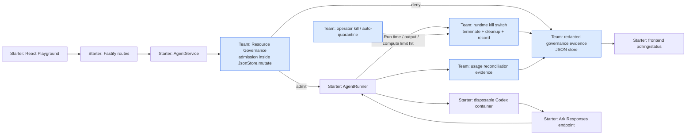

# Resource Governance Architecture

The team-added Resource Governance component has two enforcement points:

1. **Admission controls** (`sendMessage` → `admitRun`, inside `JsonStore.mutate`):
   three per-Agent limits — maximum input characters, admitted Runs, and
   cumulative model tokens. An admission guard, not a predicted-cost or per-Run
   token cap: a Run below a token limit is admitted; its actual Runtime usage
   may take the total over the limit, after which later Runs are denied.
2. **Runtime kill switch** (`executeRun` → `AgentRunner`): controls that
   **terminate a Run already in progress** and expose a `terminated` Run state
   (distinct from `failed`) plus a redacted `resource_governance.run_terminated`
   event.
   - *Per-Run duration + output bytes* — the Runner kills the Codex process /
     removes the disposable container; the Agent returns to `ready`. `null`
     falls back to `CODEX_TIMEOUT_MS` / `CODEX_MAX_OUTPUT_BYTES`.
   - *Per-Run compute caps* (`maxRunCpus`, `maxRunMemoryMb`, `maxRunProcesses`)
     — passed to the container engine as `--cpus / --memory / --pids-limit`.
     Container Runtime only; the local-process Runtime has no cgroup and ignores
     them, using the server-wide `CONTAINER_*` values.
   - *Operator kill switch* (`POST /api/agents/:id/kill`) — force-terminates any
     active Run (`terminated`, reason `operator_kill`) and stops the Agent until
     an operator restarts it.
   - *Auto-quarantine* — after `RUNTIME_QUARANTINE_THRESHOLD` runtime
     terminations within `RUNTIME_QUARANTINE_WINDOW_MS` (default 3 / 10 min) the
     Agent is stopped with a `resource_governance.agent_quarantined` event.
     Starting the Agent clears it. Operator kills are excluded from the count.

## Pipeline and boundaries

| Component | Evidence | Input → output | Role |
| --- | --- | --- | --- |
| React configuration and Playground | `apps/web/src/App.tsx`, `api.ts` | form/prompt → Fastify request and polling display | Starter UI; team-added policy fields and measured-state labels. Displays only. |
| Fastify boundary | `apps/server/src/app.ts` | validated HTTP body → `AgentService` | Starter route layer; team-added policy schema. Transports policy, not trusted enforcement. |
| AgentService | `apps/server/src/agent-service.ts`, `sendMessage()` | Agent, prompt → candidate Run / HTTP error | Starter orchestration. **Trusted enforcement boundary** because it invokes governance before `runner.run()`. |
| Resource Governance | `apps/server/src/budget-service.ts`, `evaluateAdmission()`, `admitRun()` | persisted usage + limits + input length → `AdmissionDecision` | Team-added thin middleware component. Makes and persists decisions. |
| Persistence | `apps/server/src/store.ts`, `JsonStore.mutate()` | cloned database mutation → atomic JSON rename | Starter JSON store. **Persistence/atomic boundary** for this single-process POC. |
| Runtime interface | `apps/server/src/types.ts`, `AgentRunner`; `runner-factory.ts` | `RunnerRequest` → `RunnerResult` | Starter abstraction; transports allowed work only. |
| Container Codex Runtime | `apps/server/src/container-codex-runner.ts`, `ContainerCodexRunner.run()` | workspace/prompt → `docker run ... codex exec --json` | Starter Runtime integration; launches per-turn container. |
| ModelArk Responses | `config.ts`, `writeCodexConfig()`; generated Codex config | Codex model request → JSON events | Starter provider configuration. The backend never calls the model directly. |
| Reconciliation | `codex-runner.ts`, `parseCodexEventLine()`; `AgentService.executeRun()` | `turn.completed.usage` → `AgentRun.usage` and usage evidence | Starter event parsing/persistence; team-added reconciliation evidence. |
| Runtime kill switch | `codex-runner.ts` / `container-codex-runner.ts` `run()`; `AgentService.executeRun()` catch, `killAgent()`; `recordRuntimeTermination()`, `maybeQuarantine()` | `RunnerRequest.limits` / `POST .../kill` → SIGKILL / `docker rm -f` + `RuntimeLimitError` → `terminated` Run + redacted event; repeat terminations → `agent_quarantined` | **Team-added runtime enforcement boundary.** The Runner already had global timeout/output kills; this makes them per-Agent and policy-driven, adds compute caps, an operator kill, and escalating auto-quarantine, and distinguishes a policy kill from a crash. |
| Frontend status | `App.tsx`, `pollRun()`, `refreshBudget()` | Run/budget API → current measured state | Starter polling; team-added utilization labels. |

A denied input request is recorded inside `JsonStore.mutate()` and then throws
before a Run/message is inserted. A budget-denied Run is persisted as `denied`.
In both cases `sendMessage()` returns/throws before reaching `executeRun()`;
therefore it cannot call `runner.run()`. Actual tokens arrive only after Codex
emits `turn.completed` and are persisted on the completed Run.

## Brief capability comparison

| Brief capability/example | Current implementation | Evidence | Gap |
| --- | --- | --- | --- |
| Runaway execution/cost | Per-Agent per-Run wall-clock + output-byte kill switch that terminates a Run in progress; admission budgets; CPU/memory/PID container limits | `codex-runner.ts` / `container-codex-runner.ts` (`RuntimeLimitError`), `AgentService.executeRun()`, `recordRuntimeTermination()` | No monetary cost model; token spend inside one admitted Run is bounded only by time/output, not tokens directly. |
| Quotas | Per-Agent admitted Run quota | `maxRuns`, `budgetReserved` | Single-process JSON-store scope only. |
| Token budgets | Persisted input + output token admission budget | `totalTokens()`, `evaluateAdmission()` | No prediction/reservation by design; cached input is not double-counted. |
| Trace/audit evidence | Redacted admission, policy-update, and usage events | `governanceEvents` | No external immutable audit sink or user identity. |
| Backend policy enforcement | All three controls evaluated before Runtime invocation | `AgentService.sendMessage()` | No cross-instance transaction. |
| Lifecycle updates | queued/running/completed/failed/cancelled/denied/terminated Run states; ready/busy/stopped/error Agent states incl. auto-quarantine | `AgentService.executeRun()`, `maybeQuarantine()` | No background recovery queue. |
| Recovery/operator control | start/stop/delete, cancellation, restart cleanup, operator kill switch, auto-quarantine on repeat runtime terminations | `AgentService` (`killAgent`, `maybeQuarantine`), `WorkspaceManager` | No administrator console or retry workflow; quarantine window is single-process only. |
| Identity/authorization | Optional shared application token | `app.ts` auth hook | No user/role identity; event actor is honestly `local_operator`. |
| Tool/resource policy | Codex workspace sandbox and container limits | `buildCodexArgs()`, `buildContainerRunArgs()` | No enforceable protected-path middleware in this pinned Runtime. |
| Multi-Agent coordination | Isolated Agent workspaces and per-Agent usage | workspace path + Agent IDs | No delegation, scheduling, or shared governance. |

## Current extension seams and limitations

Used seams: Fastify request validation, `AgentService` Run admission, the
`AgentRunner` interface, JSON persistence, and frontend polling. Unimplemented
brief-style components include identity-aware authorization, command/resource
policy middleware, multi-Agent scheduling, external audit export, and
cost-aware pricing controls. The highest-value future differentiator is a
resource-aware filesystem isolation boundary (newer Runtime capability or a
separate mount/overlay policy), because it would enforce protected paths by
resource rather than by fragile command syntax.
